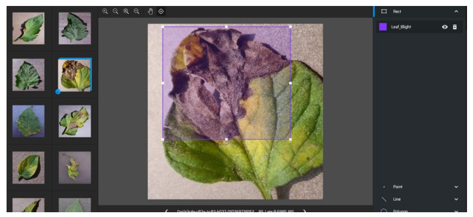
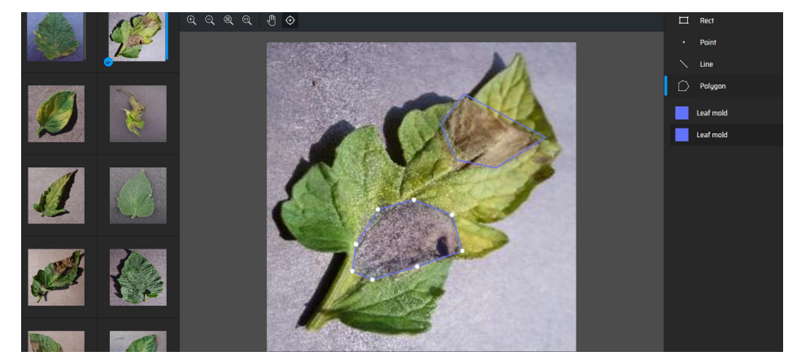

# Object-Detection-YOLOv7-MaskRCNN

The primary objective of this project is to leverage the power of YOLO and Mask-RCNN object
detection models, along with a trained CNN, to automate the detection and classification of plant
diseases. 

By enabling early identification and intervention, the project aims to contribute to
improved crop health monitoring and effective disease management practices.

#### Annotation for YOLO

To prepare images for YOLO annotation, follow these steps:

1. Annotate each image with bounding boxes for disease regions.
2. Save the annotation results in `.txt` format for each image in the `labels` folder.
3. Each text file should contain:
   - The class label (1 represents the class).
   - Four coordinates of the bounding box.

#### Annotation for Mask-RCNN

Mask-RCNN requires annotations in polygon shape. Here's how to prepare your data:

1. Annotate each image with polygons outlining disease regions.
2. Save the annotation results in a JSON file, which should contain coordinates for each line in the image.

